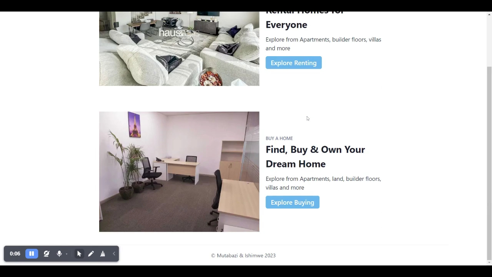

# Real Estate Rw 
> # Real Estate Rw 
> Real Estate Rw is a web application built with the aim of helping people find their dream property to buy or rent.

> Live demo [_here_](https://www.awesomescreenshot.com/video/14744642?key=6d01da484726d73106ec70c246edbacb).
> Landing page [_here_](https://real-estate-rw-landing-page.vercel.app/). And blog post [_here_](https://hbapte.hashnode.dev/real-estate-rw).

## Table of Contents
* [General Info](#general-information)
* [Technologies Used](#technologies-used)
* [Features](#features)
* [Screenshots](#screenshots)
* [Project Status](#project-status)
* [Room for Improvement](#room-for-improvement)
* [Acknowledgements](#acknowledgements)
* [Contact](#contact)
<!-- * [License](#license) -->

## General Information
Real Estate Rw is a web application built with the aim of helping people find their dream property to buy or rent. In addition, the app provides the ability for users to sell their own real estate properties. With a clean and intuitive user interface, users can easily browse and search for properties based on their location, price range, and other relevant criteria.

Our app is designed to be user-friendly and accessible, making it easy for users to find the property they are looking for. 

### With Real Estate Rw, users can:

• Search for properties based on location, price, and other relevant criteria

• View detailed property listings, including photos, descriptions, and other relevant information

## Technologies Used
- next - version 13.1.6
- Chakra-ui/react - version 2.4.9

## Features
List the ready features here:
- Responsive Web App 
- Mobile Friendly 

## Screenshots

## Project Status
Project is  _in progress_ / 
We are still working on it.

## Room for Improvement.

Room for improvement:
-  Speed enhance
-  Backend improvement

To do:
- Save favorite properties and receive alerts when new properties that meet their criteria are added

- Third party integrations

## Acknowledgements
- This project was inspired by GorkCoder and JS Mastery
- This project was based on [this tutorial](https://youtu.be/iqfxu4s6i4Y).
- Many thanks to ALX Africa

## Contact
Created by [LinkedIn@Mutabazi Jean de Dieu - LinkedIn](https://www.linkedin.com/in/jean-de-dieu-mutabazi-85024920a) & [@Ishimwe Jean Baptiste. - LinkedIn](https://www.linkedin.com/in/hbapte) - feel free to contact us!

<!-- Optional -->
<!-- ## License -->
<!-- This project is open source and available under the [... License](). -->

<!-- You don't have to include all sections - just the one's relevant to your project -->
